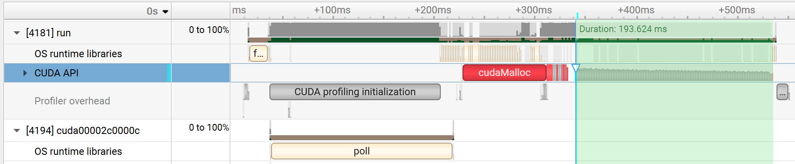

这里放置了三个版本的cuda 加速llama2， 实际上，run_naive.cu, run_version1.cu "减速" llama2推理

根据cpu version的火焰图(见flamegraph/*.svg)， matmul占据了大部分的时间。引入cuda加速矩阵乘法后，产生大量HOST, DEVICE内存交换。它们成为了新的性能瓶颈。在cuda_naive_result.ipynb, cuda_verson1_result.ipynb中可见， 内存交换的开销占据了总开销的9成以上

详细的运行结果与性能对比在三个ipynb文件，最后的结果是llama2推理速度加速了7倍左右

下面是火焰图(./flamegraph/*.nsys-rep)，即使在version2, 内存开销仍然是大头， 在version2开头， 集中分配了全局显存。其中绿色标出的是真正矩阵计算的部分

将绿色部分放大，又多个计算周期组成，每个周期如下图，出人意料，矩阵计算部分matmulkernel仍然只占一小部分

实验配置： Nvidia Tesla T4