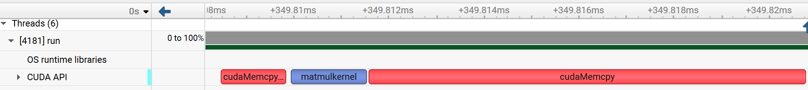

# CUDA 加速 Llama2 

---
完成实验的过程中，我**迭代**实现了3 个 CUDA 加速版本的 llama2，分别对应：

- `src/run_naive.cu`
- `src/run_version1.cu`
- `src/run_version2.cu`

性能分析对应的火焰图为：

- `flamegraph/gpu_version_naive.nsys-rep`
- `flamegraph/gpu_version1.nsys-rep`
- `flamegraph/gpu_version2.nsys-rep`

迭代思路与优化方向：

* naive 版本仅实现了`matmul`函数的替换， 特色是Grid-Stride策略累加， 配合shared memory块内并行reduction, 对矩阵乘法本身的性能优化很好，但是总体推理速度约为cpu版本的50%
 ```cpp
 __global__ void matmulkernel(float* xout, float* x, float* w, 
    int n, int d) {  
        extern __shared__ float shared_mem[];

        float* w_row = w + blockIdx.x * n;
        float* xout_row = xout + blockIdx.x;

        float sum_thread = 0.0f;
        for (int i = threadIdx.x; i < n; i += blockDim.x) {
            sum_thread += w_row[i] * x[i];
        }
        shared_mem[threadIdx.x] = sum_thread;
        __syncthreads();

        for (int stride = blockDim.x / 2; stride > 0; stride /= 2) {
            if (threadIdx.x < stride) {
                shared_mem[threadIdx.x] += shared_mem[stride + threadIdx.x];
            }
            __syncthreads();
        }

        if (threadIdx.x == 0) {  
            float sum_row_final = shared_mem[0];
            *xout_row = sum_row_final;
        }
}
 ```
* version1 版本， 猜测性能瓶颈跟内存分配和交换有关， 于是统一分配了全局显存， 性能约为cpu版的60%
```cpp
void vediomem_init(MatmulCtx* ctx, int n_max, int d_max) {
    ctx->d_x = ctx->d_w = ctx->d_out = nullptr;
    ctx->cap_n = n_max;
    ctx->cap_d = d_max;
    cudaMalloc(&ctx->d_x, n_max * sizeof(float));
    cudaMalloc(&ctx->d_w, n_max * d_max * sizeof(float));
    cudaMalloc(&ctx->d_out, d_max * sizeof(float));
}

void vediomem_free(MatmulCtx* ctx) {
    if (ctx->d_x) cudaFree(ctx->d_x);
    if (ctx->d_w) cudaFree(ctx->d_w);
    if (ctx->d_out) cudaFree(ctx->d_out);
    ctx->d_x = ctx->d_w = ctx->d_out = nullptr;
}
```
* version2 版本，实在想不通， 画了火焰图，nsys分析显示H2D, D2H开销惊人， 对应优化思路是将所有W参数矩阵一次性`cudaMemcpy`， 推理速度稳定在cpu版本的**7倍**左右
```cpp
void vediomem_init(GpuCtx* ctx, TransformerWeights* w, Config* p,
                  int n_max, int d_max) {
    int dim = p->dim;
    int kv_dim = (dim * p->n_kv_heads) / p->n_heads;
    int hidden_dim = p->hidden_dim;
    unsigned long long n_layers = p->n_layers;
    size_t size;

    #define CP_HOST2DEVICE(dst, src, len) do {                   \            
        int bytes = (len) * sizeof(float);                       \            
        cudaMalloc(&(dst), bytes);                               \            
        cudaMemcpy((dst), (src), bytes, cudaMemcpyHostToDevice); \  
    } while (0)

    CP_HOST2DEVICE(ctx->d_token_embedding_table, 
    w->token_embedding_table, p->vocab_size * dim); 
    CP_HOST2DEVICE(ctx->d_wq, w->wq, n_layers * dim * dim);
    CP_HOST2DEVICE(ctx->d_wk, w->wk, n_layers * dim * kv_dim);
    CP_HOST2DEVICE(ctx->d_wv, w->wv, n_layers * dim * kv_dim);
    CP_HOST2DEVICE(ctx->d_wo, w->wo, n_layers * dim * dim);
    CP_HOST2DEVICE(ctx->d_w1, w->w1, n_layers * dim * hidden_dim);
    CP_HOST2DEVICE(ctx->d_w2, w->w2, n_layers * dim * hidden_dim);
    CP_HOST2DEVICE(ctx->d_w3, w->w3, n_layers * dim * hidden_dim);
    CP_HOST2DEVICE(ctx->d_wcls, w->wcls, p->vocab_size * dim);            
                                                
    ctx->d_x = ctx->d_out = nullptr;
    ctx->cap_n = n_max;
    ctx->cap_d = d_max;
    cudaMalloc(&ctx->d_x, n_max * sizeof(float));
    cudaMalloc(&ctx->d_out, d_max * sizeof(float));
    #undef CP_HOST2DEVICE
}
```
---

#### 最初写的两个版本“加速”了矩阵乘法，但“减速”推理

从 CPU 版本火焰图（`flamegraph/cpu_version_origin.svg`）可见，CPU 推理时间主要消耗在 `matmul` 上，因此引入 CUDA 的动机是合理的：用 GPU 替代 CPU 的 matmul。

但问题在于：  
引入 CUDA 后，出现了大量 Host <--> Device 内存拷贝/交换，它们成为新的性能瓶颈。在以下 notebook 中可以直观看到时间分解与性能对比：

- `cuda_naive_result.ipynb`
- `cuda_version1_result.ipynb`

结论是：

内存交换开销占总开销的 90% 以上，导致即使 matmul 在 GPU 上更快，整体推理仍被拷贝成本“拖垮”。

---

#### 最终性能：`run_version2.cu` 实现约 7× 推理加速


综合四个 notebook 的最终对比结果显示：

最终推理速度约加速 **7 倍**（相对 CPU baseline）

但从火焰图/NSYS 分析来看，即使在 `run_version2.cu` 中：

- 开头已经集中分配了全局显存（减少零散分配）
- 内存相关开销仍然占主导
- 真正的矩阵计算 kernel 仅占很小一部分

 火焰图证据:

即使在优化完成的`run_version2.cu`中：内存开销仍是主导，查看计算周期：


**图源：** `./flamegraph/gpu_version2.nsys-rep`
**说明：** 每个计算周期内 **matmulKernel** 依旧不是主要耗时项。

---

naive CUDA 版本中更加夸张：矩阵乘法只占计算周期中**蓝色**的一小段


**图源：** `./flamegraph/gpu_version_naive.nsys-rep`
**说明：** 真正执行计算的部分很短，整体时间主要被 Host/Device 交换等开销占据。

---

#### 收获

1. CPU baseline 的瓶颈确实在 `matmul`，因此使用cuda 加速矩阵计算的想法是自然的
2.  naive / version1 的 CUDA 实现引入了大量 **Host/Device 内存交换**
   交换成本巨大（可达总耗时 90%+），直接抵消 matmul 的加速收益，导致“减速”。  
3. version2 通过更集中/更合理的显存管理获得了可观加速（约 7×），但从 NSYS 火焰图看，内存相关开销仍然是主要部分。  

4. 因此：根本限制来自推理过程的数据流与内存驻留方式，而不是单个 kernel 的算力不足。

仓库地址：https://github.com/yyj6666667/Llama2Accelarated

---
实验环境： Nvidia RTX 5090   和 Tesla T4, 都跑了一遍


 附：实验材料索引

- CPU 火焰图： `flamegraph/cpu_version_origin.svg`
- GPU 分析： `./flamegraph/*.nsys-rep`
- 结果对比 notebook：
  - `cuda_naive_result.ipynb`
  - `cuda_version1_result.ipynb`
  - 以及其余 2 个 notebook（共 4 个，用于最终对比与结论）
